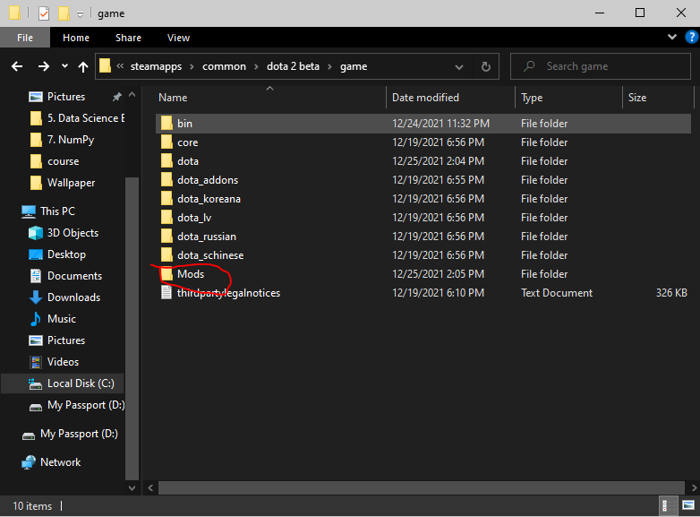
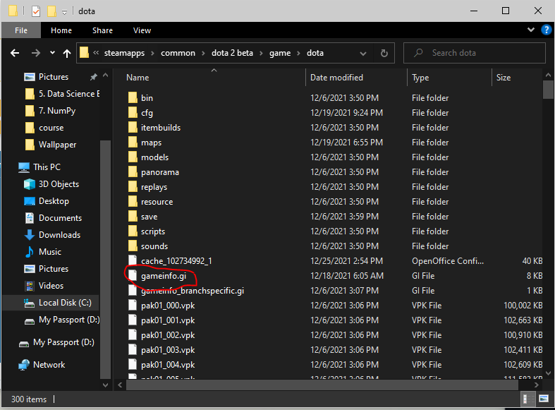

# dota2Mods
Guide to mod Dota 2

## Source
* [Forum](https://dota2shadymod.forumcommunity.net/)
* [Discord](https://discord.gg/ETPQ7rY)

## How to Install
1. Join the discord server and pick which mods you want to download
2. Download the mods file and gameinfo.gi file
4. Create a folder named "Mods" inside (..\Steam\steamapps\common\dota2 beta\game\)
5. Paste mods file "pak01_dir.vpk" to the folder "Mods"

6. Navigate to (..\Steam\steamapps\common\dota2 beta\game\dota\) 
7. Paste the gameinfo.gi

